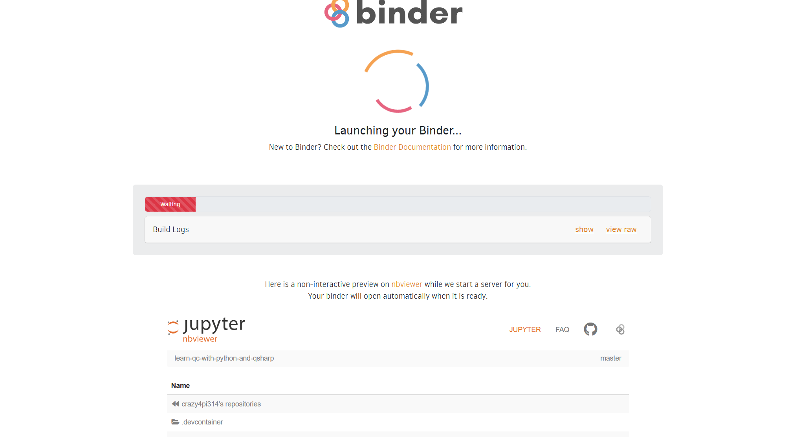

# Praktikum_Daten-_und_Prozessanalyse -> Ziel: Quantencomputing

# Grober Fahrplan:
  - Englisch aufbessern (Lesen)
  - Literatur querlesen
  - Fortschritte/Arbeit Dokumentieren
## Themen:
  - Data Science
  - Doppelspalt
  - Bra-Ket-Notation
  - Superposition
  - Fairer Zufall
  - Verschränkung und wofür
  - Matritzen
  - Problem des Handelsreisenden (Grover-Algorithmus)
## Algorithmen
  - SQD
  - Deutsch-Jozsa-Algorithmus
  - Shor-Algorithmus
## Programmierung
  - Qiskit (IBM)
  - Q#
  - Anaconda (jupyter, PostgreSQL)

# Beginn Lerntagebuch (19.06.2025), Praktikumsbeginn (04.06.2025):

    In diesem Tagebuch werden meine Lernfortschritte, Misserfolge, Erkenntnisse, Ergebnisse sowie offenen Fragen festgehalten. Das Tagebuch beginnt mit dem 19.06.2025. Vermittelte Inhalte vor dem 19.06.2025 sind in DOCUMENTATION.md notiert und werden täglich festgehalten. 
    Das Lerntagebuch dient zum einem, das gelernte systematisch zu dokumentieren, zu verarbeiten und zu reflektieren, um so den Lernprozess nachhaltig zu gestalten. Weiter dient es auch als Nachweiß über erbrachte Leistungen (Proof Of Work). Zu Guter Letzt soll das Lerntagebuch einem digitalen Agenten übergeben werden, der mit dem Wissen Auszubildenden, Studierenden oder Lernenden unterstützen kann. 

# Woche 1+2 (04.06.2025 - 19.06.2025):
    Die ersten 2 Wochen waren zunächst recht unstrukturiert. Seit Tag eins habe ich einen groben Fahrplan an die Hand bekommen und einfach drauf losgelegt und die Themen oberflächlich und oder teilweise angegangen. Ich musste feststellen, dass ich zunächst erstmal mir Grundlagen aneignen muss um die Materie überhaupt angehen zu können. Des Weiteren gibt es sehr viele kleinere Unterthemen die es täglich nach und nach anzugehen gilt. 
    Dabei musste ich feststellen, dass einige Tools zunächst lernen musste zu bedienen. Angefangen der Umgang mit Gitkraken i.V.m. Github. 
    Zusammengfasst waren die ersten beiden Wochen keine fortschrittlichen Wochen.  Diese dienten zum Ankommen im Praktikumsbetrieb, zum Einrichten, zum Kennenlernen der Kollegen und zum Orientieren. Jetzt weiß ich grob, was ich alles an Skills benötige, um im Bereich Quanteninformatik mit Fokus auf Quantenalgorithmen foran zu kommen. 

# Tag 11 (19.06.2025):
  - Programmieren in Python lernen an: 
    * Matrixoperationen
    * Beispiele für O-Notationen (O[1], O[log n], O[n], O[n²], O[n!])
        Erklärung in Youtube angeschaut

Das Programmieren ist mit schwer gefallen - KI hat ausgeholfen - und Bedarf dringend Nachholbedarf. Beim Verstehen von Codezeilen hat mir ein Arbeitskollege das Debuggen in Visual Studio Code gezeigt und es half mir sehr, eine Funktion zu verstehen (Aha-Effekt).

def lineare_Suche(data, Zielwert):
    """Durchsucht eine Liste nach einem Zielwert (lineare Suche)."""
    for Index, Element in enumerate(data):  # Ein Durchlauf über alle Elemente
        if Element == Zielwert:
            return Index  # Gefundener Index
    return "nicht gefunden"  # Nicht gefunden

"Beispielaufruf"
numbers = [4, 2, 7, 1, 9, 5]
numbers2 = [3, 8, 6, 0, 2]
target_value = 2

Ergebnis = lineare_Suche(numbers2, target_value)
print(f"Der Wert {target_value} wurde im Index {Ergebnis} gefunden.")
print(numbers)

Ich verstand nicht, wo das Array numbers oder numbers2 von der Funktion lineare_Suche() verwendet wird. Mir wurde es sehr gut vom Kollegen erklärt und die Debuggingfunktion half, mir den Prozess zu durchlaufen Schritt für Schritt. 
Der oben angegebene Algorithmus stellt eine O(n) Laufzeitkomplexität dar, da die for-Schleife n-Schritte durchläuft bis zu einem Ergebnis. Wären 2 for-Schleifen gekoppelt dann gilt: O(n*n) = O(n²). Der Aufwand erhöht somit und für jede Mengeneingabe steigt der Aufwand nun quadratisch an anstatt linear wie bei O(n). 
Die O-Notationen oder auch Landaunotationen geben die Laufzeitkomplexität in Abhängigkeit zur Eingabemenge an. 

Gefühlt habe ich heute nicht viel geschafft, allerdings ist der Lerneffekt dafür nachhaltig und wird nicht so schnell wieder vergessen.

# Tag 12 (20.06.2025):
  - Python: Pandas -> Scatterplotts und Korrelationen
            Numpy Arrays
            Training -> Funktionen schreiben

Heute habe ich das Programmieren mit Python trainiert und einen Datensatz auf analysiert und visualisiert. Da das Programmieren noch nicht so leicht von der Hand geht, habe ich einige Funktionen geschrieben (Funktionen.jpynb).

Der heutige Tag stimmt mich traurig, da mein Vorgesetzter nicht zufrieden mit mir ist und das Gefühl hat, so habe ich es zumindest verstanden, dass ich nicht genügend Interesse für Informatik mitbringe. Das ist für mich unverständlich. 

# Wochenende (22.06.2025):
  - Fahrplan nach " 1, 2, 3 Daily" angepasst (mehr im Lerntagebuch)

Fahrplan nochmals angepasst mit klarem Ziel: Quantenalgorithmen in der Logistik zum Einsatz bringen. Der Weg dorthin wird im Dreiklang (1,2,3 Daily) von Quanteninformatik, Daten und Prozesse begleitet und harmoniert perfekt mit 
dem Fach des Daten- und Prozessanalysten. Der Höhepunkt wird das Projekt sein, welches den Titel "Hybride Optimierung von Logistikrouten: Quantenalgorithmen (QAOA) vs. klassische Methoden am Beispiel Traveler-Salesman-Problem" tragen wird.

Ich schätze das Ziel als sehr ambitioniert ein und denke, dass die verbleibenden acht Monate nicht ausreichen werden, allerdings irre ich mich auch gerne. 

# Tag 13 (23.06.2025):
  - Quantenmechanik zum Anfassen [Youtube](https://www.youtube.com/watch?v=LaGPEWb1VFk)
    * Quantengatter
  - Daten: Distanzmatrix in Python, Daten beschaffen, in Python einlesen und Berechnungen durchgeführt
  - Prozesse: BPMN-Model eines Störungsfalls in der Logistikbranche

Quantenmechanik:
Der Vortrag von Prof. Dr. Steffen Glaser Quantenmechanik zum Anfassen veranschaulicht sehr gut, wie sich Qubits verhalten, wenn man Sie manipuliert. 
Hadamard-Gatter: bringt in Superposition, CNOT-Gatter in Abhängigkeit zu Qubit X: Verschränkung zweier Qubits, Messgatter: Messung
Die Schaltkreise sind ideal, um besondere Algorithmen zu entwerfen. 

Daten:
Die Entfernungen zueinander von 48000 Städten zu berechnen scheiterte an der Hardware meines laptops. 2000 Städte tatens auch. Bei der Berechnung der Entfernung bediente
ich mich der Haversine-Formel in Python. 
Größte Hürde war, die CSV auf 2001 Zeilen runterzukürzen und diese in Python wieder einzulesen. Python fand die Spalten auf Mal nicht mehr. DIe CSV hatte ich mit EXCEL 
bearbeitet. Zwei Stunden habe ich rumprobiert, bis es mit Notepad ++ die Erlösung möglich war, die CSV zu bearbeiten und dann von Python einlesen zu lassen. Woran es lag 
weiß ich allerdings immer noch nicht. Aber ich hab das Problem zunächst erstmal selbst gelöst. 

Prozesse: 
Das BPMN-Modell stellt ein Szenario in der Losistikbranche eines Logiistikunternehmens dar. Rund 15000 Frachten müssen innerhalb kürzester Zeit neu disponiert werden. Hier
sollen verdeutlich werden, das darüber beschieden werden muss, ob und in welchem Maße Quantentechnologien zum Einsatz kommen soll, um die 15000 Frachten binnen kürzester zeit
umzudisponieren.

# Tag 14 (24.06.2025):
  - Buch: Learn Quanten Computing with Python and Q# (Seite 1-18)

Quanten:
Das Buch Learn Quantum computing with Python and Q# hat einen für mich wesentlichen Aspekt auf den ersten Seiten geliefert. Quantencomputer werden vorerst nur
spezielle Aufgaben lösen können und des Weiteren sind sie hinsichtlich der Eingabemenge sehr begrenzt. Lediglich Eingaben von höchstens ein paar dutzend Bits 
können Quantensysteme der heutigen Größe aufzeichnen. Und zu guter Letzt gibt es auch bisher keine festen Regeln, um zu entscheiden, welche Aufgaben am besten
auf klassischen Computern und welche Aufgaben die Vorteile von Quantencomputern nutzen können.

Daten:
Die Datenbank über die Städte und unter anderem ihre Koordinaten habe ich die Spalte Liefermenge in Paletten hinzugefügt. 
LKWs laden Paletten, die irgendwo hin müssen. Die Städte haben jetzt Liefermengen zugeteilt bekommen womit man jetzt Routen planen kann, wie und wo ein LKW hinbringt und oder auflädt. Die Komplexität für einen Algorithmus wird sich erhöhen. Um wie viel, das werde ich in Kürze herausfinden. 
"Quintessenz": Die Komplexität vor der die Logistik an sich steht ist immens und garnicht mehr vorstellbar. 

Prozesse:
Digitaler Zwilling: Wie schon mit Kklaus besprochen bietet der digitale Zwilling Möglichkeiten der Daten- und Prozessanalyse. Gerade beim Abbild von Maschinen, ganzen Produktionsanlagen oder sogar ganzer Unternehmen oder Konzerne kommen 
unermesslich viele Daten zusammen, die gerade dazu einladen analysiert und benutzt zu werden, um Prozesse zu optimieren im Machine Learning einzusetzen oder Statistiken für Verhalten, Abnutzung, Vorhersagen, Unternehmensentscheidungen und vieles mehr zu erstellen.

ActiveDB:
Laut Internet und Youtubeauftritten eines Partners der Firma bill-x kann ActiveBD als Schnittstelle mit der Fülle an Daten 
, die in Maschinen anfallen umgehen und damit zugleich Kunden- und Unternehmenspreferenzen gerecht werden. 

# Tag 15 (25.06.2025):
  - Q#: Versuch Q# unter Visual Studio Code zum Laufen zu bringen
    * Versuch Code zum Laufen zu bringen gescheitert

Quanten: Q#-Code zum Laufen zu bekommen ist gescheitert. Zunächst habe ich versucht die Umgebung in Visual Studio Code für Q# herzustellen. Daran bin ich kläglich gescheitert. 
         Co-Pilot konnte mir weitestgehend helfen, bin aber auch damit bei einem Schritt gescheitert. für Q# war eine Installation von Nöten und .Net Version 6.0.42, die explizit nur
         mit Visual Studio Code kooperiert. Nachdem ich mehrere .NET Versionen probiert hatte, habe ich gemerkt, dass ich die Umgebungsvariabel ändern musste. Darüber hinaus musste
         ich auch feststellen, dass ich mehrere Python Versionen installiert hatte und musst die ältere Version deinstallieren. 
         Ab einem gewissen Punkt wollte ich auf Conda umschwenken und ab da an ging gar nichts mehr. 
         Zurück zu Visual Studio Code habe ich es nach Stunden endlich hinbekommen die Umgebung so einzurechten, dass ich im Prinzip starten konnte zu programmieren.
         Gleich habe ich Beispiel zwei Codes in Q# aus dem Buck "Learn Quantum Computing with Python and Q#" ausprobiert, die nicht funktionierten. Das Buch verwies auf ein 
         Repository, dass alle Code-Zeilen aus dem Buch enthält (https://github.com/crazy4pi314/learn-qc-with-python-and-qsharp) Leider ohne Erfolg. 
         die beiden Beispiele aus dem Buch liefen lediglich nach Korrektur auf (https://quantum.microsoft.com/en-us/tools/quantum-coding)
         Die Code-Zeilen aus dem Repository sind drei Jahre alt. Wahrscheinlich hat sich seither einiges geändert, ist meine Vermutung. Ricarda konnte mir leider auch 
         nicht helfen. Kai hat es geschafft, dass die Fehlermeldung nach dem Ausführen eines Programms wegfiel indem wir die Namespaces im Code von Q# entfernten. 
         Nachdem über ein halber Tag draufgegangen ist, werde ich mich Qiskit und Python und Jupyter zuwenden, was bisher reibungslos funktionierte.

                  

        

